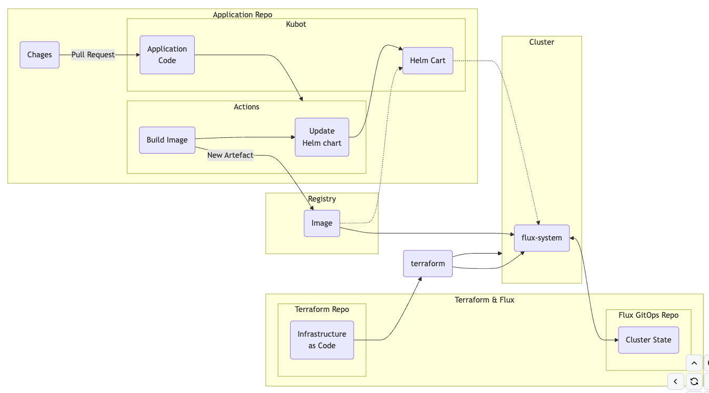

# Terraform k8s and Flux Bootstrap

This project uses Terraform to
- create a Kubernetes cluster of choice: local using kind, remote aws eks or google gke
- set up a Github repository to store Kubernetes manifests
- bootstrap the cluster using Flux

## Pre-requisites

- Terraform installed (version >= 1.15.2)
- AWS Platform account
- Github account

## Configuration

Export variables:
export TF_VAR_GITHUB_OWNER=
export TF_VAR_GITHUB_TOKEN=
export TF_VAR_FLUX_GITHUB_REPO=

## Terraform modules used

### `hashicorp-tls-keys`

This module creates a TLS private key and self-signed certificate. It exports the private key in PEM format and the public key in OpenSSH format.

### `github-repository`

This module creates a private Github repository and a deploy key. The public key is passed from the `hashicorp-tls-keys` module.

### `fluxcd-flux-bootstrap`

This module installs Flux in the Kubernetes cluster and sets it up to read manifests from the Github repository created by the `github-repository` module. It also generates a private key for Flux to use to authenticate with Github.

### `cluster-kind`

This module creates a local Kubernetes cluster using kind.

## Usage

```shell
terraform init
terraform apply
export KUBECONFIG=$(terraform output -raw kubeconfig_path)
kubectl get nodes
kubectl -n flux-system get all
```
## Flux CLI
Install

```
brew install fluxcd/tap/flux
```

Generate manifests
```
flux create source git kbot \
    --url=https://github.com/dmzopi/kbot \
    --branch=main \
    --namespace=demo \
    --export

flux create helmrelease kbot \
    --namespace=demo \
    --source=GitRepository/kbot \
    --chart="./helm" \
    --interval=1m \
    --export
```
Push manifests to FluxCD repo provided in TF_VAR_FLUX_GITHUB_REPO and watch logs for reconcilation
```
flux logs -f
```
Verify installed components
```
flux get -A all
```

## General CI/CD




## License
MIT License. See LICENSE for full details. 
